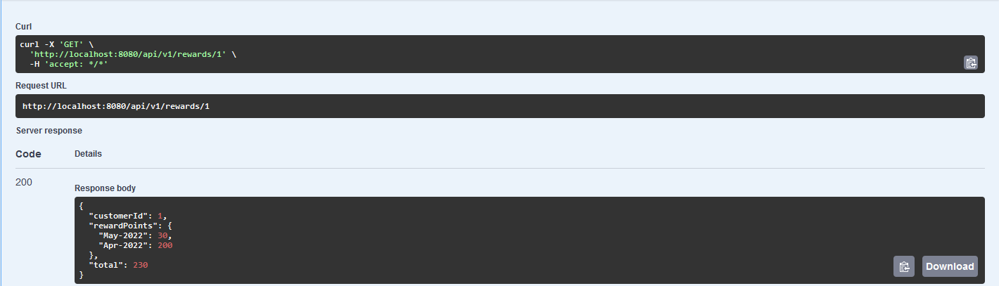

# Reward Points System

1. I have created two set of APIs, first for inserting transactions and second for calculating the rewards.
2. I have used H2 as in memory database and on the startup few transactions for customer Id `1` is being loaded by default.
3. For API specifications I have used swagger for ease of testing and validating the response.
4. I have used default health check endpoint of actuator for this application. It can be accessed via `http://localhost:8080/actuator/health` this url.
5. You can access the swagger via `http://localhost:8080/swagger-ui.html`. Swagger displays the actuator URLs as well.

### How to start the application?
```
For starting the application please import the application in any of the preferred IDE (Intellij, Eclipse, STS, etc.)

Application can be started by executing the main method present in class RewardPointsApplication.
And the reward calculation API would be accessible via http://localhost:8080/api/v1/rewards/1
```

## How to run the test cases?

```
Test cases are present in RewardsControllerTest and it can be executed directly using preferred IDE.
```

## Docker commands to start the application

```
Before starting the application first execute the mvn clean install command.
After that execute the commands:
a. docker build -t rewards .
b. docker run -p 8080:8080 rewards
```

## Dataset

This is sample data it is not same as used in the project as I am generating dates randomly.

| Customer ID | Price | Product Name | Date       |
|-------------|-------|--------------|------------|
| 1           | 40.0  | Test Product | 05/15/2022 |
| 1           | 120.0 | Test Product | 04/15/2022 |
| 1           | 70.0  | Test Product | 03/25/2022 |
| 1           | 20.0  | Test Product | 03/25/2022 |
| 1           | 60.0  | Test Product | 05/15/2022 |
| 1           | 130.0 | Test Product | 05/15/2022 |

#### Output for the same
```
{
  "customerId": 1,
  "rewardPoints": {
    "May-2022": 120,
    "Apr-2022": 90,
    "Mar-2022": 20
  },
  "total": 230
}
```

## Sample request

```
curl -X 'GET' \
  'http://localhost:8080/api/v1/rewards/1' \
  -H 'accept: */*'
```

## Sample response

```
{
  "customerId": 1,
  "rewardPoints": {
    "May-2022": 30,
    "Apr-2022": 200
  },
  "total": 230
}
```



